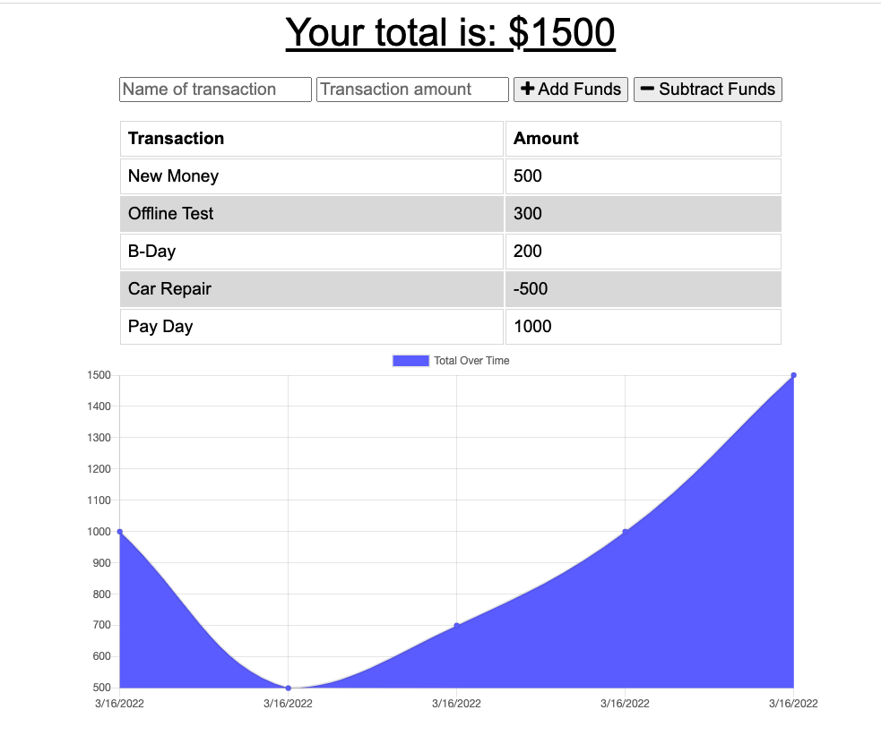

# Budget Tracker

## Description

The Budget Tracker application allows users to keep track of their deposits and expenses both online and offline. This application was designed with a mobile-first mentality, and has taken into consideration users experiencing poor or a lack of internet while using the app. With the Budget Tracker, users no longer have to worry about having a solid internet connection to successfully and effectively track their deposits and expenses. 

## Table of Contents
  * [Built With](#built-with)
  * [Code Access](#code-access)
  * [Preview](#preview)
  * [Installation](#installation)
  * [Usage](#usage)
  * [Link](#link)
  * [License](#license)
  * [Questions](#questions)
  * [Credits](#credits)

## Built With

The Budget Tracker was built with:
- JavaScript
- Node.js
- Mongoose
- MongoDB
- Express.js

## Code Access

If you would like to access the code for the Budget Tracker, please visit [GitHub](https://github.com/sm3131/budget-tracker)

## Preview

Below is a screenshot displaying the Budget Tracker's user interface, and the functionality of the app:

## Installation
The Budget Tracker is a deployed application, which can be visited using the link posted below in the "Link" section of the README. But if you would like to install and run the app locally you can follow the installation steps below:

1. Clone the application's code from this [GitHub](https://github.com/sm3131/budget-tracker) repository onto your local machine into a new directory (e.g. budget-tracker).
2. Open the command line and navigate to the directory you cloned this repository into, then open the content in a code text editor. You should now see the main files and folders for this project (server.js, package.json, /models, /routes, /public).
3. Next check to see if you have node.js installed on your machine by running the command *node -v* in your command line.
4. If you have node.js make sure your version is up to date by going to this website (https://nodejs.org/en/).
5. If you do not have node.js installed follow the installation steps on this website (https://nodejs.org/en/).
6. Once you have node.js installed, make sure you are still in the budget-tracker directory in the command line, and then run the following command *npm install* to install the required packages and dependencies to run the application.
7. Next you will need to make sure you have mongoDB installed in the command line to create the budget tracker database for this application. Follow this link (https://docs.mongodb.com/manual/installation/) to install and run mongoDB on your local machine. 
8. After you have node.js, mongoDB, and the required npm dependencies installed, you are ready to start the express server and connect to mongoDB via mongoose using node.js in the command line, in order to use the budget tracker application.

## Usage

After either visiting the Budget Tracker link below or installing the Budget Tracker app using the steps above, you can follow the usage directions below to begin tracking your deposits and expenses.

Skip to step 5 if you are visiting the Budget Tracker app via the link below, otherwise start at step 1 after installation to get the app up an running.

1. Once you have properly cloned and installed the budget tracker app, you will need to get the server running and connect to the mongoDB database via the command line.
2. In the command line after you have run *npm install*, you will enter the command *npm start* to get the server running.
3. If this command was successful you should see a message indicating which port the app is running on, which you can then visit in your browser.
4. This app should be running on port 3001, so in your browser visit localhost:3001 which should take you to the budget tracker application.

5. Once you have arrived at the budget tracker application there are several functionalities this app provides to the user.
6. Within the app you will see two input boxes below the "Your total is:" line at the top of the screen, and next to the second box there are two buttons, one for adding funds and one for subtracting funds
7. To enter a transaction you will need to enter a name for this transaction, and then a dollar amount for the transaction. 
8. Then depending on if this is a deposit or expense, you will either add or subtract funds respectively.
9. Once you have entered your first transaction, you will see this addition or deduction reflected on both the total line above, and in the chart and graph below.
10. The chart organizes all of the entered transactions by name and dollar amount, and the graph plots each transaction then connects the plot points and fills in under the curve to show a continuous tracking of your budget.
11. All transactions are stored in the applications database, so you can leave and return to the application without fear of losing your budget entries.
12. The Budget Tracker also offers offline capabilities, so as a user you can still use the application without internet, and once your internet connection returns all transactions will be sent to and saved in the database.
13. The Budget Tracker will provide a fully functional user interface while offline, and it will store any transactions you enter locally in the browser, so that offline entries can be later stored in the database when the internet connection returns. 

## Link

If you would like to visit the deployed Budget Tracker application please follow the link below:

https://budget-tracker-3031.herokuapp.com/

## License

MIT License

Copyright (c) 2022 Sammi Moore

Permission is hereby granted, free of charge, to any person obtaining a copy
of this software and associated documentation files (the "Software"), to deal
in the Software without restriction, including without limitation the rights
to use, copy, modify, merge, publish, distribute, sublicense, and/or sell
copies of the Software, and to permit persons to whom the Software is
furnished to do so, subject to the following conditions:

The above copyright notice and this permission notice shall be included in all
copies or substantial portions of the Software.

THE SOFTWARE IS PROVIDED "AS IS", WITHOUT WARRANTY OF ANY KIND, EXPRESS OR
IMPLIED, INCLUDING BUT NOT LIMITED TO THE WARRANTIES OF MERCHANTABILITY,
FITNESS FOR A PARTICULAR PURPOSE AND NONINFRINGEMENT. IN NO EVENT SHALL THE
AUTHORS OR COPYRIGHT HOLDERS BE LIABLE FOR ANY CLAIM, DAMAGES OR OTHER
LIABILITY, WHETHER IN AN ACTION OF CONTRACT, TORT OR OTHERWISE, ARISING FROM,
OUT OF OR IN CONNECTION WITH THE SOFTWARE OR THE USE OR OTHER DEALINGS IN THE
SOFTWARE.

## Questions

If you would like to access this project's repository as well as other projects in my GitHub, click this [GitHub](https://github.com/sm3131) link. 

For all other questions or inquires please feel free to contact me via email at [sm2683@nau.edu](mailto:sm2683@nau.edu)

## Credits

The Budget Tracker was created using starter code in combination with code written by myself, Sammi Moore. The starter code was provided by Xandromus, and can be accessed by clicking on this [GitHub](https://github.com/coding-boot-camp/symmetrical-bassoon) link. The starter code contained all of the front-end functionality, as well as the server and api routes to allow the user to send data from the front-end to the back-end and mongoDB database. My contribution to this code was to make the application functional offline. I added indexedDB and a service worker to store data in the browser and then allow users to track their budgets offline or with poor internet connection respectively. I also added a manifest.json file in order for the app to be converted into a PWA.

The resources that I used for this project are as follows:
- The mongoose package from npm in this node.js application in order more easily use mysql databases (https://www.npmjs.com/package/mongoose)
- The express package from npm to create the server and routes (https://www.npmjs.com/package/express)
- Heroku for application deployment/hosting (https://dashboard.heroku.com/)
- MongoDB Atlas (https://www.mongodb.com/atlas/database) for application deployment to host the database on heroku
- https://opensource.org/licenses/ (To borrow the license section text describing the terms of each of the licenses included in the readme generator)
- https://shields.io/ (To generate the link to create the license badge)
For the license badges and license section of the readme, I used the following resources:
- https://choosealicense.com/ (To help with picking which licenses to include)
- https://shields.io/ (To generate the link to create the license badge)
- https://wisehackermonkey.github.io/badge-demo/ (To help with coloring the license badges and grabbing the license links)
- https://opensource.org/licenses/ (To borrow the license section text describing the terms of each of the licenses included in the readme generator)